Insura — Insurance Management Platform

A full-stack insurance management platform built as an internship project. It lets customers browse insurance plans, apply for coverage with OTP-based verification, pay premiums in installments, and file claims — while admins and agents manage the entire business through a dedicated dashboard.

Introduction

Traditional insurance processes involve a lot of manual paperwork, long approval cycles, and difficulty tracking policies. Insura digitizes this entire flow — from a customer discovering a plan, applying for it with document verification, to filing and tracking a claim later.

The platform supports three roles:

Customer — browse plans, apply for policies, pay premiums, file and track claims
Agent — manage customers, review and approve/reject claims
Admin — full control: manage insurance plans, employee accounts, and monitor the business through an analytics dashboard
Live Links

Service	URL
Frontend (Vercel)	https://insurance-management-zeta.vercel.app
Backend API (Render)	https://insurance-management-1pe9.onrender.com
API Docs (Swagger)	https://insurance-management-1pe9.onrender.com/docs

Note: the backend is hosted on Render's free tier, so the first request after inactivity may take 30–50 seconds while the server spins up.

Screenshots

Screen	Preview
Landing Page	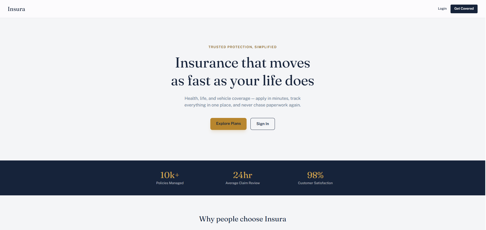
Landing Page	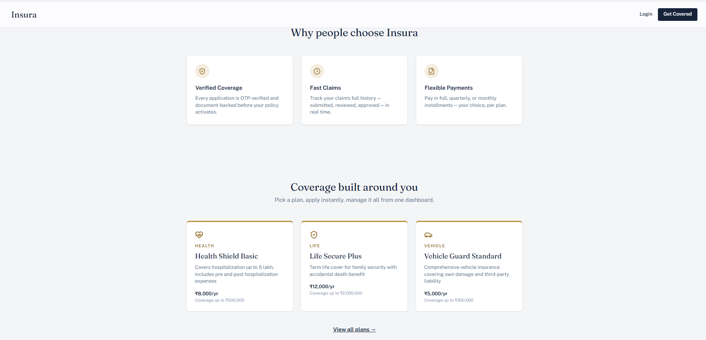
Login	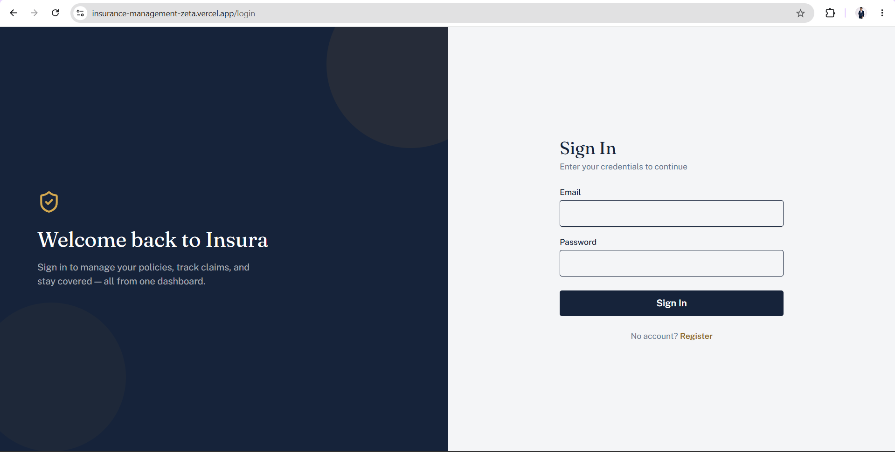
Register	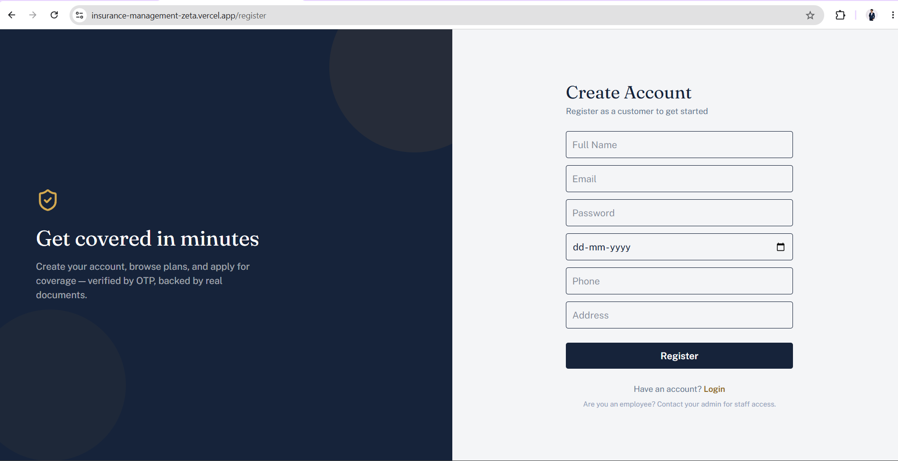
Customer Dashboard	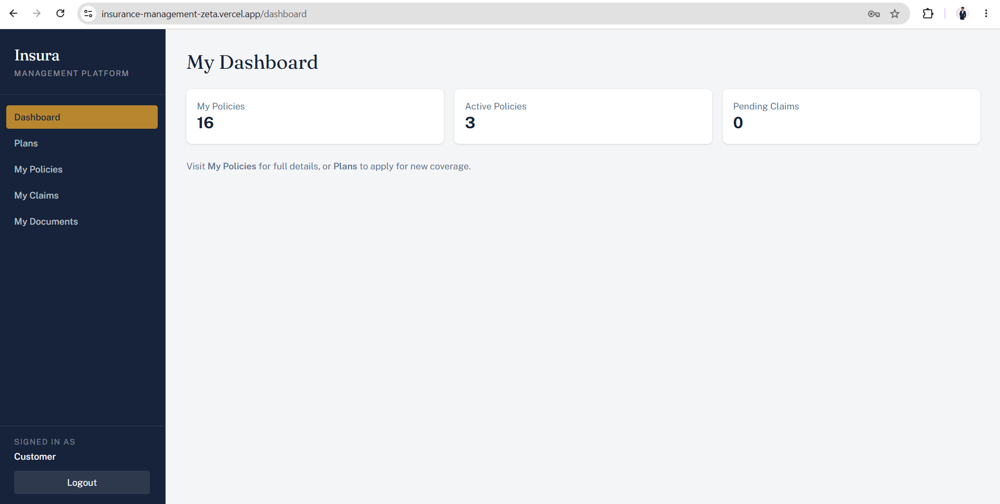
Admin Dashboard	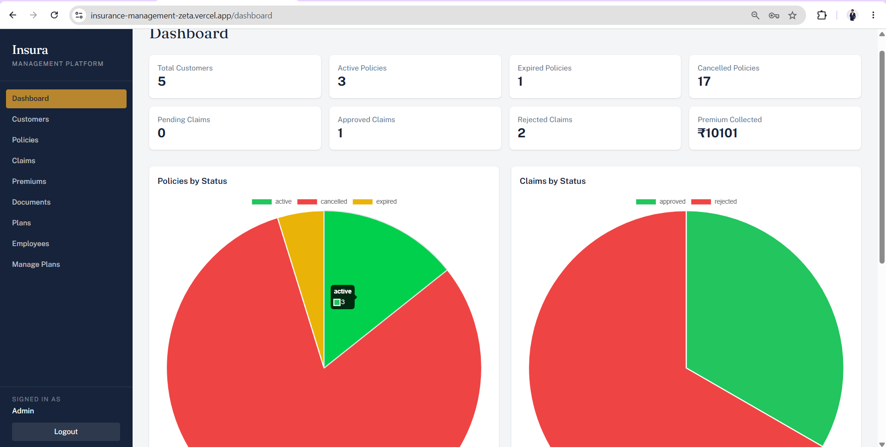
[Admin Dashboard](./screenshots/admin2.png)
Plans Page	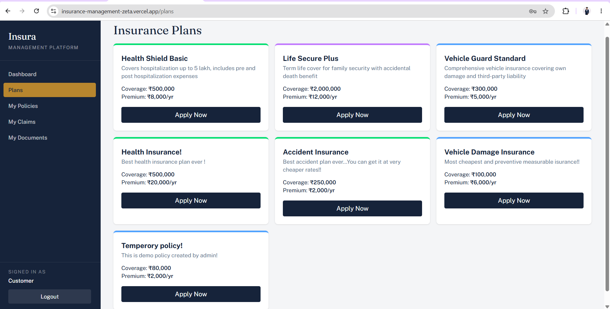
Apply for Policy (Form)	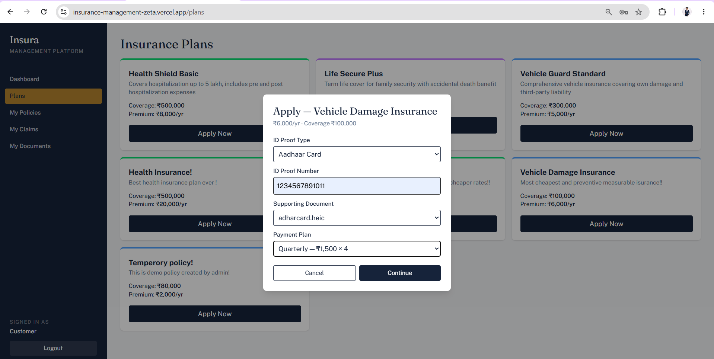
My Policies	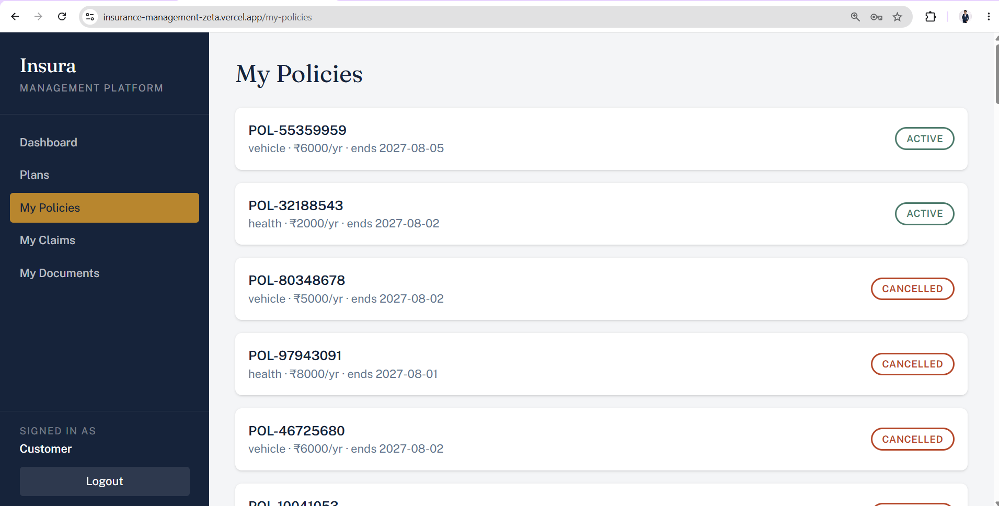
[My Policies](./screenshots/my-policy2.png)
Claims	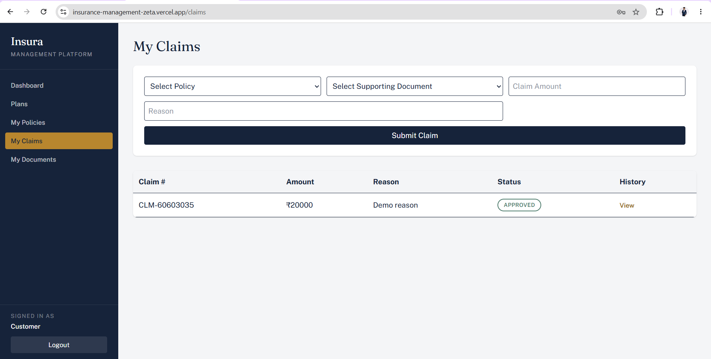
Claim History	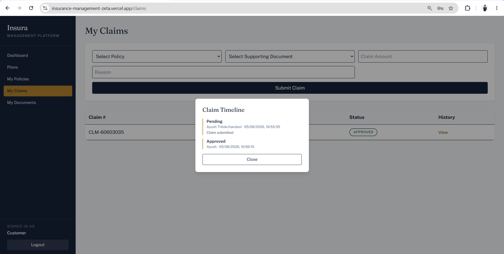
Manage Plans (Admin)	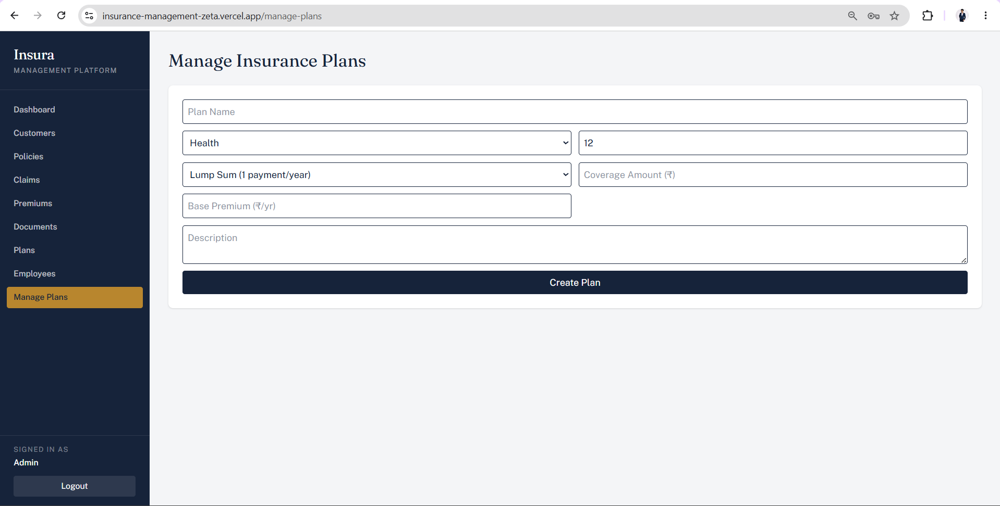
Employee Management	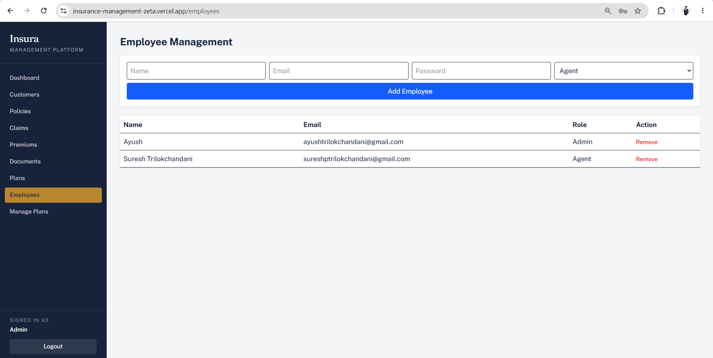
Claim managemnet (Admin) 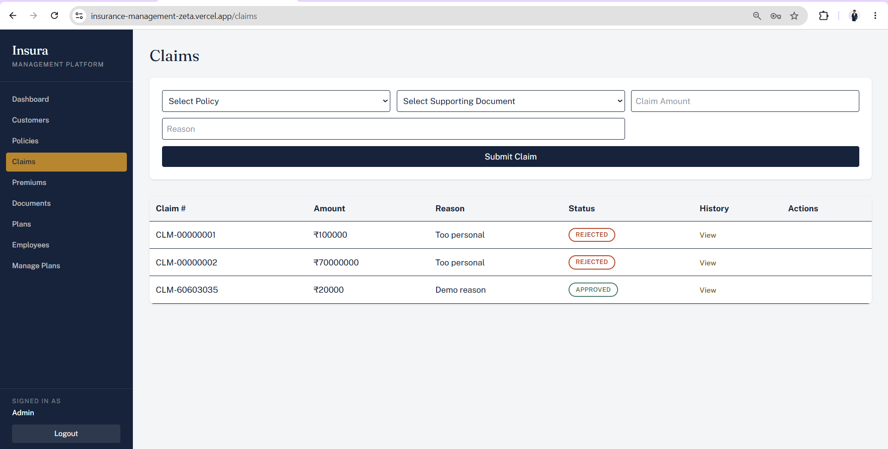
Customer documents managemnet (Admin) 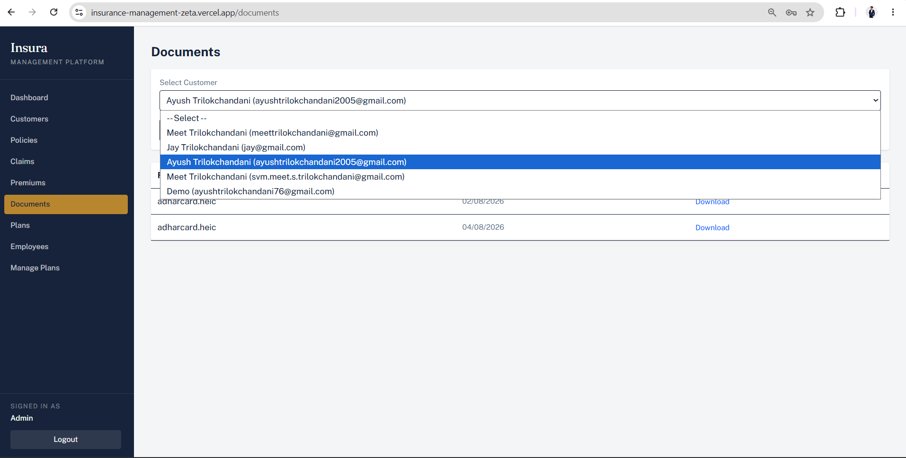

Tech Used:

Frontend

React (Vite)
Tailwind CSS v4
React Router
Axios
Chart.js (dashboard analytics)
Lucide React (icons)

Backend

FastAPI (Python)
SQLAlchemy (ORM)
Alembic (database migrations)
Pydantic (validation)
JWT (python-jose) for authentication
Passlib / bcrypt for password hashing
Resend (transactional email — OTP verification, notifications)

Database

PostgreSQL, hosted on Neon (serverless Postgres)

Deployment

Backend — Render
Frontend — Vercel
Folder Structure
insurance-management-platform/
│
├── backend/
│   ├── app/
│   │   ├── main.py              # FastAPI app entry point
│   │   ├── config.py            # environment settings
│   │   ├── database.py          # DB connection setup
│   │   ├── models/              # SQLAlchemy models (User, Customer, Policy, Claim, etc.)
│   │   ├── schemas/             # Pydantic request/response schemas
│   │   ├── routers/             # API route handlers (auth, policies, claims, etc.)
│   │   ├── core/                # security, JWT deps, email
│   │   └── services/            # shared business logic (status sync, etc.)
│   ├── alembic/                 # database migrations
│   ├── requirements.txt
│   └── .env
│
└── frontend/
    ├── src/
    │   ├── api/                 # axios instance + config
    │   ├── components/          # reusable UI components
    │   ├── pages/                # route-level pages
    │   ├── context/              # auth context
    │   ├── services/             # API call functions per module
    │   └── App.jsx                # routing
    └── package.json
Industrial Use

This project models real patterns used in production insurance and fintech systems:

Role-based access control — customers, agents, and admins each see and can do only what's relevant to them
OTP-based verification — policy applications are confirmed via email OTP before activation, similar to real KYC flows
Document-backed claims — claims require a supporting document and can never exceed a policy's coverage limit
Audit trail — every claim status change is logged with who changed it and when
Installment-based billing — customers choose lump sum, quarterly, or monthly payment plans
Automated status sync — policies and payments automatically transition to expired/overdue based on real dates
Email notifications — staff can trigger reminders for expiring policies and overdue premiums

These are the same building blocks — auth, RBAC, verification, audit logging, billing cycles — used in real insurance, banking, and healthcare platforms, just simplified for a project scope.

Conclusion

Insura started as a basic CRUD app and was built up into a role-based, end-to-end platform — covering authentication, document handling, OTP verification, installment billing, claims workflows, and admin analytics. It reflects how a real insurance product's core user journeys — from applying for coverage to filing a claim — actually connect together, rather than treating each feature as an isolated screen.
